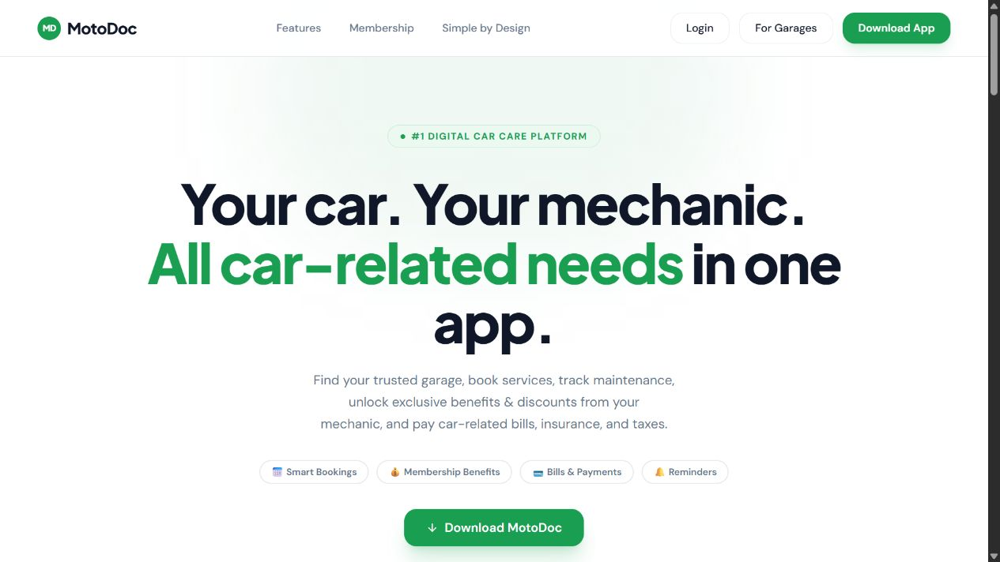
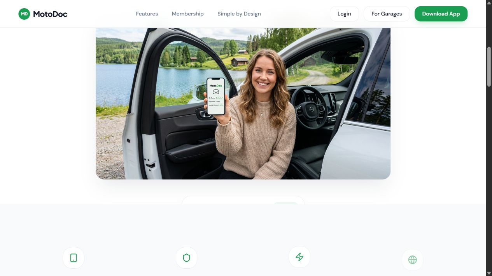
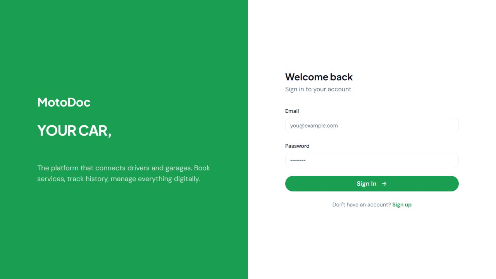
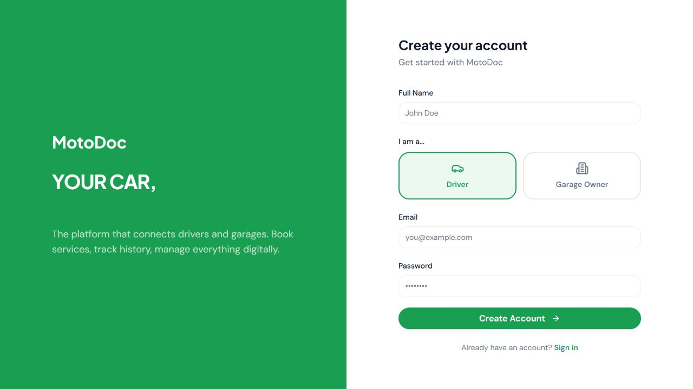
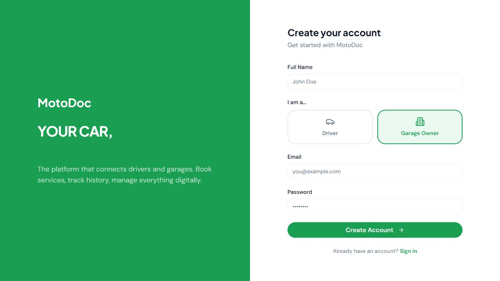
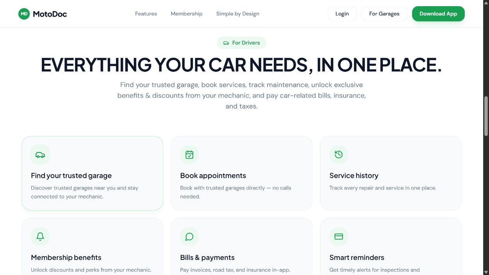
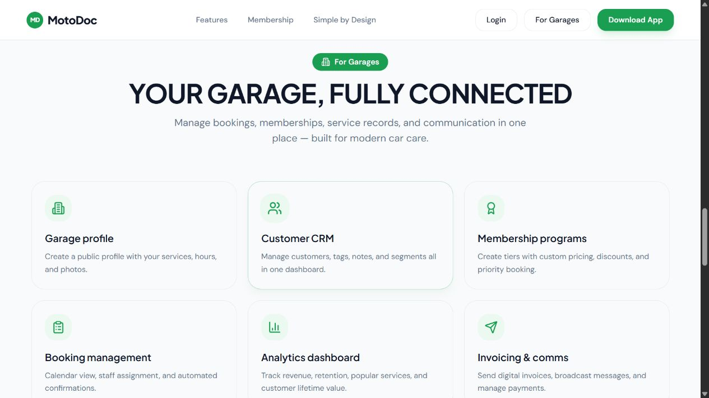
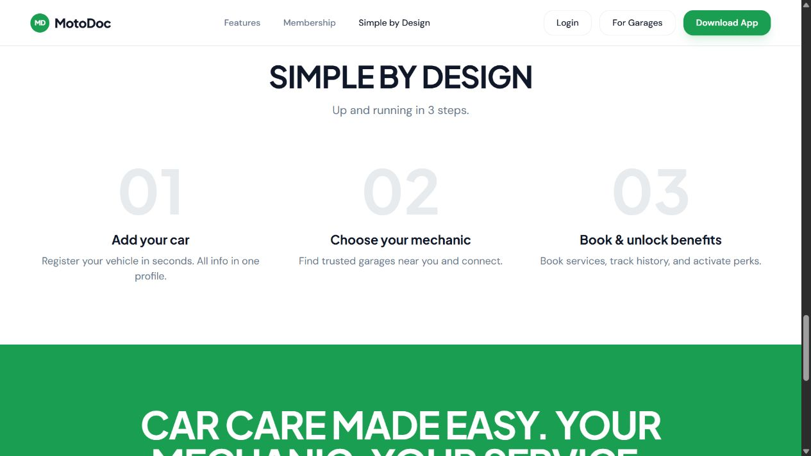
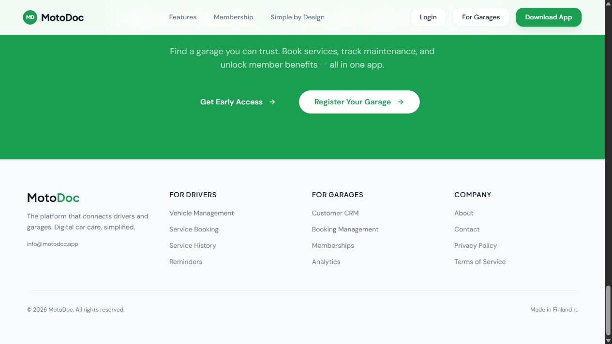

# MotoDoc public-site review

Inspected 29 September 2026: https://tidy-pixel-lab.lovable.app/

Scope: desktop public landing page, navigation, sign-in and registration choices. No account created or login submitted. Dashboards, real bookings, payments, backend and mobile behaviour remain untested.

## 1. Landing hero — needs refinement

Consistent green, white and dark-text identity. Oversized heading occupies most of the first viewport and leaves the product visual below the fold. Membership changes the URL to #membership without moving to a section.

## 2. Hero image — layout concern

Car-related imagery supports the product. The small dashboard card below it appears obscured by the following section in this captured view; verify its positioning and animation.

## 3. Sign-in — incomplete experience

Download App opens sign-in. Labels are visible, but no password recovery or password visibility control is shown. FULLY CONNECTED exists in the accessibility text but is invisible in the captured left-hand heading.

## 4. Driver registration — clear basic structure

Name, email, password and role choices are easy to identify. No visible password requirements. Account creation and validation were not tested.

## 5. Garage registration — role selection works visually

Garage Owner selection changes the selected styling. Form fields stay the same. Onboarding after submission is unknown.

## 6. Driver features — clear but repetitive

Six cards explain garages, appointments, history, membership, bills and reminders. Similar visual weighting makes prioritisation weak. Some icons do not match their labels well, such as the bell for membership and payment-card icon for reminders.

## 7. Garage features — readable structure

Six cards explain profiles, CRM, memberships, bookings, analytics and invoicing. A real dashboard preview would explain the product better than another similarly weighted card grid.

## 8. How it works — understandable

Three steps clearly explain adding a car, choosing a mechanic and booking. Pale numbers and secondary text warrant contrast checks.

## 9. Final calls to action and footer — navigation needs correction

Register Your Garage opens Welcome back sign-in rather than garage registration. About, Contact, Privacy Policy and Terms of Service have # destinations in the observed navigation. Download and Early Access wording also leave product availability unclear.

## Priorities

Fix destination mismatches and missing links. Preserve brand colours, reduce hero height and improve product demonstration. Add recovery and password guidance to authentication. Review authenticated driver and garage accounts before committing to their redesign scope.

Accessibility findings are risks, not measured compliance failures. Contrast ratios, keyboard navigation, screen-reader behaviour, zoom and mobile reflow need further testing.
